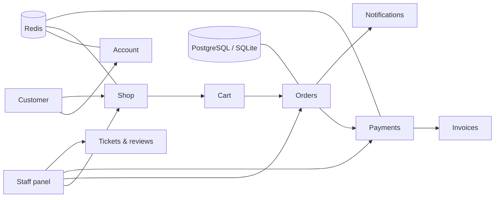

# Django Online Shop Backend

[](https://www.djangoproject.com/)
[](https://www.python.org/)
[](#quality-and-security)
[](https://redis.io/)
[](https://www.postgresql.org/)

A reusable, security-focused Django backend for online shops. It includes the
complete domain layer for products, carts, orders, payments, invoices, wallets,
notifications, support tickets, and a custom staff management panel.

> This repository focuses on backend behavior. It does not include a designed
> frontend or a real payment gateway.

## Architecture



## Highlights

- Phone-number authentication with a custom user model
- Product categories, reviews, replies, and scheduled per-product discounts
- Persistent carts with server-side price and stock validation
- Order workflow, shipping methods, cancellation rules, and 10% tax snapshots
- Idempotent test payments, refunds, invoices, wallets, and transaction history
- Customer addresses, support tickets, private attachments, and notifications
- Custom staff panel outside Django's default `/admin/`
- Staff activity audit trail and a dashboard for application errors
- Redis caching, sessions, rate limits, distributed locks, and Celery queues
- PostgreSQL production configuration and SQLite development configuration
- JSON logs, request IDs, health endpoints, and optional Sentry integration

## Quick start

```bash
python -m venv .venv
# Windows: .venv\Scripts\activate
# Linux/macOS: source .venv/bin/activate
pip install -r requirements-dev.txt
python manage.py migrate
python manage.py createsuperuser
python manage.py runserver
```

Redis is required outside the test environment. On Windows, the included helper
starts the local Redis-compatible service:

```powershell
.\start_redis.ps1
.\start_worker.ps1
```

The custom staff area is available at `/management-panel/`. The built-in Django
admin is disabled by default.

## Production

Copy the variable names from [`.env.example`](.env.example) into your deployment
environment. The example file is documentation only and is not loaded automatically.
Production requires PostgreSQL, Redis, SMTP credentials, a strong secret key, and
explicit allowed hosts.

```bash
python manage.py check --deploy --settings=config.production
python manage.py migrate --settings=config.production
```

Read [SECURITY.md](SECURITY.md) before deployment and [OBSERVABILITY.md](OBSERVABILITY.md)
for logging, health checks, database error records, and Sentry configuration.

## Quality and security

```bash
python manage.py test --noinput
python manage.py makemigrations --check --dry-run
python -m pip check
python -m pip_audit -r requirements.txt --no-deps --disable-pip
```

The current suite contains **145 passing tests**. Critical financial and inventory
flows use database transactions, row locks, atomic updates, idempotency references,
and server-calculated price snapshots. See `SECURITY.md` for deployment assumptions
and remaining operational controls.

## Main apps

| App | Responsibility |
| --- | --- |
| `account` | Users, addresses, wallets, password flows, and support tickets |
| `shop` | Products, categories, discounts, reviews, and public catalog selectors |
| `cart` | Customer carts and cart items |
| `orders` | Checkout, shipping, order lines, status transitions, and tax |
| `payments` | Test payment lifecycle, idempotency, cancellation, and refunds |
| `invoices` | Immutable invoice snapshots |
| `notifications` | User notifications and read state |
| `management_panel` | Staff operations, audit activities, metrics, and system logs |

## Scope

This is a backend starter, not a hosted payment product. Replace the test gateway
with a verified provider integration before accepting real payments. A REST API is
not included, so the domain logic can be reused with Django views or Django REST
Framework in future projects.
